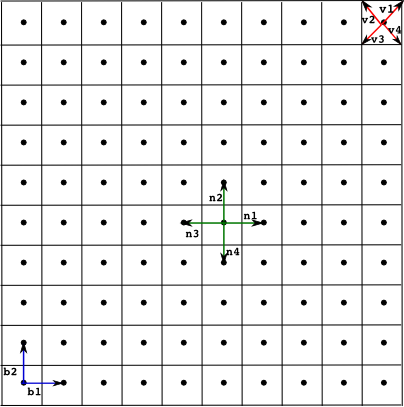
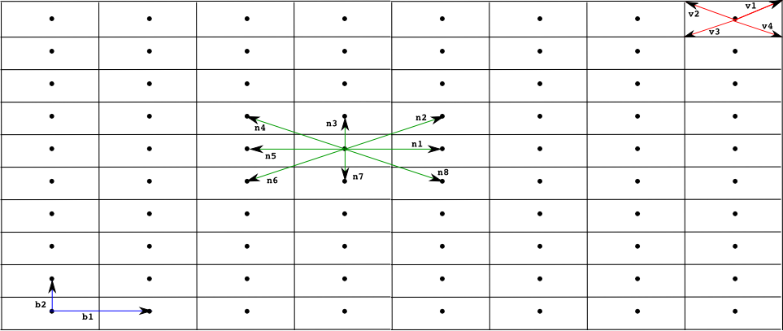
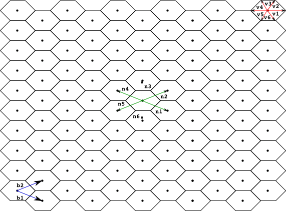

****************************************
Specification of Geometric Distribution
**************************************** 

The *spatial distribution* of the different cell types in multi-cellular systems such as tissues or colonies of cells plays a crucial role in processes involved in cell signalling [Burkhard2007]_. The *Infobiotics modelling language* allows the user to capture characteristic spatial distribution in multi-cellular systmes using **finite point lattices** as described in this section. 

A *finite point lattice*, lattice for short, is a grid of regularly distributed spatial points in R\ :sup:`n` (n=1 or 2 in the current version of the Infobiotics Workbench). A lattice is determined by a set of **basis vectors** {b\ :sub:`1`\,..,b\ :sub:`n`\}, and two sets of  lower and upper integer **bounds**, {l\ :sub:`1`, ...,l\ :sub:`n`} and {u\ :sub:`1`,...,u\ :sub:`n`} respectively. The points of a regular lattice are then obtained as all the possible linear combinations of the basis vectors with integer coefficients within the given bounds:

                                                               Lat = { p = c\ :sub:`1`\* b\ :sub:`1`\ + ... + c\ :sub:`n`\* b\ :sub:`n`\ :  c\ :sub:`i`\ is an integer between l\ :sub:`i` and u\ :sub:`i`}     

Note that a point in a lattice is uniquely identified by the coefficients c\ :sub:`i` and therefore it will be represented as (c\ :sub:`1`, ..., c\ :sub:`n`).

Each point in a lattice is associated with a **neighbourhood**, set of points assumed to be near the given one. A neighbourhood of size k is determined by a set of vectors {n\ :sub:`1`\,..,n\ :sub:`k`\}. Given a point p in a lattice its k neighbours are computed as p\ :sub:`i` = p + n\ :sub:`i`. 

We also associate with each point in the lattice a regular polygon, (typically a square, rectangle or hexagon) used to produced a **tesellation of the space**. This polygon is determined by a set of vectors {v\ :sub:`1`, ..., v\ :sub:`q`} used to compute each vertix, *vertix*\ :sub:`i`, of the polygon associated with a point in the lattice p as *vertix*\ :sub:`i` = p + v\ :sub:`i`.  The name of the polygon used for the tesellation is normally used as an adjective for the lattice, below we present the most commonly used lattices so far in models developed within the Infobiotics workbench, namely, **square, rectangular and hexagonal lattices**.    

   Example of a *square lattice* with a neighbourhood of four points. The lattice is determined by the basis vectors {b\ :sub:`1`, b\ :sub:`2`}, the neighbourhood {n\ :sub:`1`,n\ :sub:`2`,n\ :sub:`3`,n\ :sub:`4`} and the polygon defined by the vertices {v\ :sub:`1`,v\ :sub:`2`,v\ :sub:`3`,v\ :sub:`4`}.

   Example of a *rectangular lattice* where each point has a neighbourhood of eight points.

   Example of a *hexagonal lattice* with a neighbourhodd of six points

A regular lattice must be specified in the *Infobiotics Workbech* in a text file with the extension *.lat* in order to allow its reusability in order muti-cellular systems with the same geometrical distribution but different cell types. The components of a lattice are specified according to the following general skeleton::

   lattice latticeName

      dimension	d
      xmin	x1
      xmax	x2
      ymin	y1
      ymax	y2

      parameters
            ...
      endParameters

      basis
            ...
      endBasis

      vertices
            ...
      endVertices

      neighbours
            ...
      endNeighbours

An identifier *latticeName* is associated with the lattice specification that consists of the enumeration of the components of a lattice. The dimension, one or two, is declared following the key word *dimension*. The lower and upper bounds for the first and possibly the second coefficients used in the generation of the lattice points is stated next after the keywords *xmin*, *xmax*, *ymin* and *ymax*. The last two can be omitted if the dimension of the lattice is one. Paramaters used in the definition of the basis, vertix and neirghbour vectors must be declared within the block *parameters ... endParameters* as *parameter parameterName value=val* .

The basis vectors are specified in the block *basis ... endBasis*,  the vertices in the block *vertices ... endVertices* and the neighbours in the block *neighbours ... endNeighbours*. Each vector must be declared as *(firstComponent, secondComponent)*.

For example, in our running example we use the following square lattice  ::

   lattice rectangular

      dimension	2
      xmin	0
      xmax	10
      ymin	0
      ymax	30

      parameters
          parameter a value = 1
      endParameters

      basis
          (a,0)
          (0,a)
      endBasis

      vertices
          (a/2,a/2)
          (-a/2,a/2)
          (-a/2,-a/2)
          (a/2,-a/2)
      endVertices

      neighbours
          (1,0)
          (-1,0)
          (0,1)
          (0,-1)
      endNeighbours
