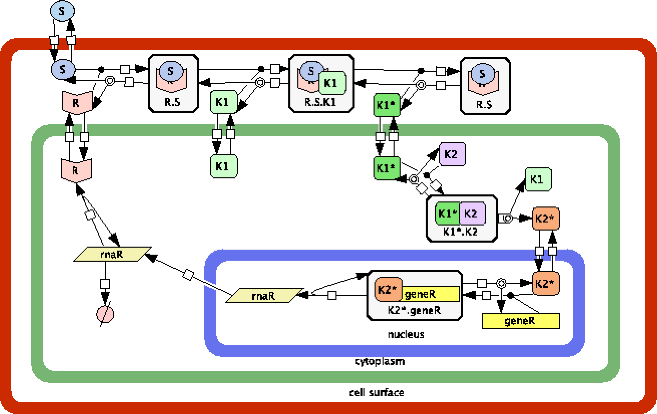

*******************************
Specification of Cell Types
******************************* 

Individual cells are the elementary unit of our models. Nevertheless, they are not represented as homogeneous bags in our framework. Instead we use **Stochastic P-systems (SP-systems)** [Romero-Campero2009]_ as the computational abstraction for an individual cell. The specification of an individual cell consists of the following three main components:

1. The **molecular species**  (genes, RNAs, proteins, signals etc.) present in the specific cell type are represented using string-objects like *proteinGFP*, *signal3OC6*, etc.

2. The **compartments** (cytoplasm, nucleus, mitochondria, etc) of individual cells as well as some relevant regions related to individual cells (cell surface, media surronding a cell, etc.) are defined using *membranes*. The inclusion of compartments inside other compartements as in the case of the nucleus being inside the cytoplasm can also be specified.

3. The characteristic **molecular interactions** taking place inside or between specific compartments are described using rules where the reactant and product molecules are specified as well as the compartment involved in the interaction and a stochastic constant used to compute the probability of applying each rule and the time elapsed between rule applications. 

   Example of an *SP-system* model of a cell type with three compartments, cell surface, cytoplasm and nucleus, string-objects representing molecular species as receptors, signals and genes and molecular interactions specified as rules describing a signal transduction pathway.   

The specification of the components of a model of an individual cell using the **Infobiotics modelling language** is described in the following sections:

.. toctree::
   :maxdepth: 2

   singleCellSpecification
   moduleLibraries
