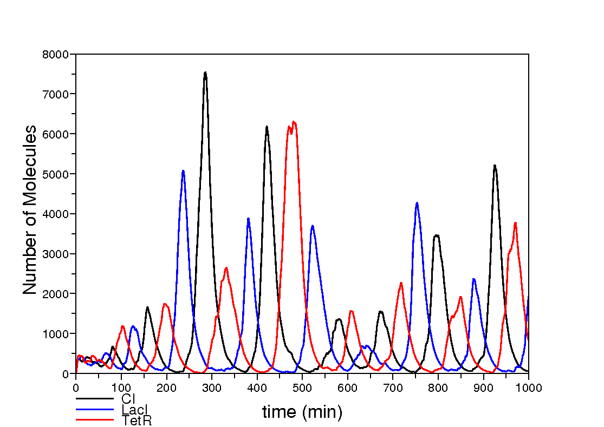

########################
Pulse Generator
########################

===========================
Introduction
===========================
 
The **pulse generator** example consists of the synthetic bacterial colony designed by Ron Weiss' group in [Basu2005]_.  This model implements the propagation of a wave of gene expression in a bacterial colony. The complete model can be downloaded from this link. 

The **pulse generator** consists of two different bacterial strains, *sender cells* and *pulsing cells*: 

  * **Sender cells** contain the gene *luxI* from *Vibrio fischeri*. This gene codifies the enzyme LuxI responsible for the synthesis of the molecular signal *3OC6-HSL*. The *luxI gene* is expressed constitutively under the regulation of *the promoter PLtetO1* from the tetracycline resistance transposon. 

  * **Pulsing cells** contain the *luxR gene* from *Vibrio fischeri* that codifies the *3OC6-HSL* receptor protein LuxR. This gene is under the constitutive expression of the promoter *PluxL* from *Vibrio fischeri*. It also contains the *gene cI* from *lambda phage* codifying the repressor CI under the regulation of the promoter *PluxR* that is activated upon binding of the transcription factor *LuxR_3OC6_2*. Finally, this bacterial strain carries the *gene GFP* that codifies the green fluorescent protein under the regulation of the synthetic promoter *PluxPR* combining the *Plux* promoter (activated by the transcription factor *LuxR_3OC6_2*) and the *PR* promoter from *lambda phage* (repressed by the transcription factor CI).

.. figure:: Repressilator.png
   :scale: 40
   :alt: alternate text
   :align: center

=========================
The Model
=========================

Our model of the **Pulse Generator** uses a module library describing the regulation of the different promoters used in the two bacterial strains. This library is presented below::

   # This module library describes the regulation of the gene promoters used in the #
   # pulse generator circuit developed by Ron Weiss' group #
   libraryOfModules promoterLibrary

      # This module represents the constitutive expression of a gene X under the regulation #
      # of the promoter PLtetO1 from the tetracycline resistance transposon #
      PLtetO1({X},{c_1},{l}) = 
      {
         rules:
            r1: [ PLtetO1_geneX ]_l -c1-> [ PLtetO1_geneX + rnaX_RNAP ]_l
      }      

      # This module represents the constitutive expression of a gene X under the regulation #
      # of the promoter PluxL from Vibrio fischeri #
      PluxL({X},{c_1},{l}) = 
      {
         rules:
            r1: [ PluxL_geneX ]_l -c1-> [ PluxL_geneX + rnaX_RNAP ]_l
      }      

      # This module represents the positively regulated expression of a gene X under the control #
      # of the promoter PluxR which is activated by LuxR_2 #
      PluxR({X},{c_1, c_2, c_3},{l}) =
      {
         rules:
            r1: [ LuxR2 + PluxR_geneX ]_l -c_1-> [ PluxR_LuxR2_geneX ]_l
            r2: [ PluxR_LuxR2_geneX ]_l -c_2-> [ LuxR2 + PluxR_geneX ]_l 
            r3: [ PluxR_LuxR2_geneX ]_l -c_3-> [ PluxR_LuxR2_geneX + rnaX_RNAP ]_l 
      }

      # This module represents the positivele/negatively regulated expression of a gene X under the control #
      # of the synthetic promoter PluxPR that combines the activation by LuxR2 with the repression by CI2 #
      PluxPR({X},{c_1,c_2,c_3,c_4,c_5,c_6,c_7,c_8,c_9},{l}) =
      {
         rules:
            r1: [ LuxR2 + PluxPR_geneX ]_l -c_1-> [ PluxPR_LuxR2_geneX ]_l 
            r2: [ PluxPR_LuxR2_geneX ]_l -c_2-> [ LuxR2 + PluxPR_geneX ]_l 
            r3: [ LuxR2 + PluxPR_CI2_geneX ]_l -c_3-> [ PluxPR_LuxR2_CI2_geneX ]_l
            r4: [ PluxPR_LuxR2_CI2_geneX ]_l -c_4-> [ LuxR2 + PluxPR_CI2_geneX ]_l
            r5: [ CI2 + PluxPR_geneX ]_l -c_5-> [ PluxPR_CI2_geneX ]_l
            r6: [ PluxPR_CI2_geneX ]_l -c_6-> [ CI2 + PluxPR_geneX ]_l
            r7: [ CI2 + PluxPR_LuxR2_geneX ]_l -c_7-> [ PluxPR_LuxR2_CI2_geneX ]_l 
            r8: [ PluxPR_LuxR2_CI2_geneX ]_l -c_8-> [ CI2 + PluxPR_LuxR2_geneX ]_l 
            r9: [ PluxPR_LuxR2_geneX ]_l -c_9-> [ PluxPR_LuxR2_geneX + rnaX_RNAP ]_l
      }

   endLibraryOfModules

An additional module library describing several post-transcriptional regulatory mechanisms is also used in our model::

   # This module library describes some general post-transcriptional regulatory mechanisms #
   libraryOfModules postTrasncriptionalRegulation

      # This module represents transcription termination, translation, rna and protein degradation #
      PostTransc({X},{c_1,c_2,c_3,c_4,c_5},{l}) =
      {
         rules:
         r1: [ rnaX_RNAP ]_l -c_1-> [ rnaX ]_l
         r2: [ rnaX ]_l -c_2-> [ rnaX + proteinX_Rib ]_l
         r3: [ rnaX ]_l -c_3-> [ ]_l
         r4: [ proteinX_Rib ]_l -c_4-> [ proteinX ]_l
         r5: [ proteinX ]_l -c_5-> [ ]_l
      }
      
      # This module represents the dimerisation of a protein X #
      Dim({X,Y},{c_1,c_2},{l}) =
      {
         rules:
         r1: [ proteinX + proteinX ]_l -c_1-> [ Y ]_l
         r2: [ Y ]_l -c_2-> [ ]_l
      }

      # This module represents the dimerisation of a protein X in the presence of a signal S #
      DimSig({X,S,Y},{c_1,c_2,c_3,c_4},{l}) =
      {
         rules:
         r1: [ proteinX + signalS ]_l -c_1-> [ proteinX_S ]_l
         r2: [ proteinX_S ]_l -c_2-> [ ]_l
         r3: [ proteinX_S + proteinX_S ]_l -c_3-> [ Y ]_l
         r4: [ Y ]_l -c_4-> [ ]_l
      }

      # This module represents the free diffusion of a singal X in a rectangular latice #
      Diffusion({X},{c_1},{l}) = 
      {
         rules:
         r1: [ signalX ]_l =(1,0)=[ ] -c_1-> [ ]_l =(1,0)=[ signalX ]
         r2: [ signalX ]_l =(-1,0)=[ ] -c_1-> [ ]_l =(-1,0)=[ signalX ]
         r3: [ signalX ]_l =(0,1)=[ ] -c_1-> [ ]_l =(0,1)=[ signalX ]
         r4: [ signalX ]_l =(0,-1)=[ ] -c_1-> [ ]_l =(0,-1)=[ signalX ]
      }

   endLibraryOfModules

The two different bacterial strains, sender cells and pulsing cells, are represented using the following two SP-system models::

   SPsystem senderCell

      alphabet
         Pconst_geneLuxI 
         proteinLuxI
         proteinLuxI_Rib
         rnaLuxI
         rnaLuxI_RNAP
         signal3OC6
      endAlphabet

      compartments
         cell
      endCompartments

      initialMultisets
         initialMultiset cell
            Pconst_geneLuxI 1
         endInitialMultiset
      endInitialMultisets

      ruleSets

         ruleSet cell

            Pconst({LuxI},{0.001},{cell}) from promoterLibrary.plb

            PostTransc({LuxI},{3.36,0.0667,0.004,3.78,0.0667},{cell}) from promoterLibrary.plb

            r1: [ proteinLuxI ]_cell -c1-> [ proteinLuxI + signal3OC12 ]_cell                   c1 = 5

            Diffusion({3OC6},{2},{cell}) from postTranscriptional.plb

            r2: [ signal3OC12 ]_cell =(1,0)=[ ] -c2-> [ ]_cell =(1,0)=[ signal3OC12 ]           c2 = 2
            r3: [ signal3OC12 ]_cell =(-1,0)=[ ] -c3-> [ ]_cell =(-1,0)=[ signal3OC12 ]         c3 = 2
            r4: [ signal3OC12 ]_cell =(0,1)=[ ] -c2-> [ ]_cell =(0,1)=[ signal3OC12 ]           c4 = 2
            r5: [ signal3OC12 ]_cell =(0,-1)=[ ] -c2-> [ ]_cell =(0,-1)=[ signal3OC12 ]         c5 = 2

         endRuleSet

      endRuleSets

   endSPsystem

The modules in this library model the following basic gene regulatory mechanisms:

  * *Const({X},{c_1},{l}):* This module describes the constitutive expression of a gene $X$ which produces the corresponding messenger at a rate of *c_1*

SP-system::

   SPsystem repressilatorCell
 
      alphabet
          geneCI
          geneLacI
          geneTetR
          proteinCI
          proteinCI2_geneLacI
          proteinCI_geneLacI
          proteinLacI
          proteinLacI2_geneTetR
          proteinLacI_geneTetR
          proteinTetR
          proteinTetR2_geneCI
          proteinTetR_geneCI
          rnaCI
          rnaLacI
          rnaTetR
      endAlphabet
      
      compartments
          bacterium
      endCompartments
      
      initialMultisets
         initialMultiset bacterium
            geneLacI      1
            geneCI         1
            geneTetR     1
         endInitialMultiset
      endInitialMultisets

      ruleSets
         ruleSet bacterium	

            CoopNegReg({CI,LacI},{1,224,1,9,0.0005,0.0005},{bacterium}) from basicLibrary.plb
            Const({LacI},{0.5},{bacterium}) from basicLibrary.plb
            PostTransc({LacI},{0.00578,0.167,0.00116},{bacterium}) from basicLibrary.plb

            CoopNegReg({LacI,TetR},{1,224,1,9,0.0005,0.0005},{bacterium}) from basicLibrary.plb
            Const({TetR},{0.5},{bacterium}) from basicLibrary.plb
            PostTransc({TetR},{0.00578,0.167,0.00116},{bacterium}) from basicLibrary.plb

            CoopNegReg({TetR,CI},{1,224,1,9,0.0005,0.0005},{bacterium}) from basicLibrary.plb 
            Const({CI},{0.5},{bact}) from basicLibrary.plb
            PostTransc({CI},{0.00578,0.167,0.00116},{bacterium}) from basicLibrary.plb

         endRuleSet
      endRuleSets 
   endSPsystem

========================
Simulations
========================

.. =========================
.. Model Checking
.. =========================
