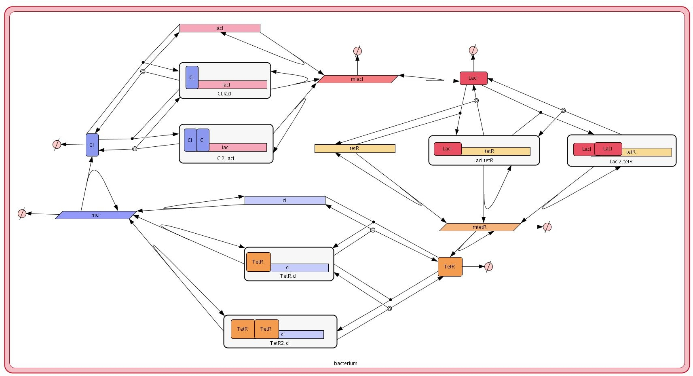
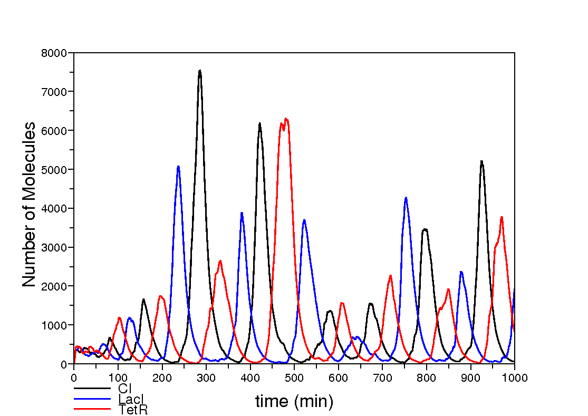

########################
The Repressilator
########################

===========================
Introduction
===========================
 
The **Repressilator** is one the first implemented *synthetic genetic circuits*. It was developed by Michael B. Elowitz and Stanislas Leibler [Elowitz2000]_ . It has been used as a canonical example in synthetic biology in various P system studies [Gheorghe2009]_. 

The **Repressilator** consists of three genes codifying three repressors. Namely, the operon lactose repressor, *lacI*, the repressor form the tetracycline transposon, *tetR*, and a repressor from the λ phage virus, *cI*. These genes are conected in a synthetic gene regulatory network such that LacI represses the expression of the tetR gene, which in turn represses the cI gene. Finally the cycle is closed as CI represses the expression of the lacI gene.

=========================
The Model
=========================

Our model of the *Repressilator* consists of a single bacterial cell modelled as a *SP-system* identified with the name *repressilatorCell*. The molecular interactions in this *SP-system* are defined in a modular manner by using the modules in the library *basicLibrary*:: 

   libraryOfModules basicLibrary

      Const({X},{c_1},{l}) = 
      {
          r1: [ geneX ]_l -c_1-> [ geneX + rnaX ]_l 
      }

      CoopNegReg({X,Y},{c_1,c_2,c_3,c_4,c_5,c_6},{l}) =
      {
          r1: [ proteinX + geneY ]_l -c_1-> [ proteinX_geneY ]_l 
          r2: [ proteinX_geneY ]_l -c_2-> [ proteinX + geneY ]_l 
          r3: [ proteinX + proteinX_geneY ]_l -c_3-> [ proteinX2_geneY ]_l 
          r4: [ proteinX2_geneY ]_l -c_4-> [ proteinX + proteinX_geneY ]_l 
          r5: [ proteinX_geneY ]_l -c_5-> [ proteinX_geneY + rnaY ]_l 
          r6: [ proteinX2_geneY ]_l -c_6-> [ proteinX2_geneY + rnaY ]_l 
      }

      PostTransc({X},{c_1,c_2,c_3},{l}) = 
      {
          r1: [ rnaX ]_l -c_1-> [ ]_l
          r2: [ rnaX ]_l -c_2-> [ rnaX + proteinX ]_l 
          r3: [ proteinX ]_l -c_3-> [ ]_l 
      }

   endLibraryOfModules

The modules in this library model the following basic gene regulatory mechanisms:

  * *Const({X},{c_1},{l}):* This module describes the constitutive expression of a gene $X$ which produces the corresponding messenger at a rate of *c_1*

SP-system::

   SPsystem repressilatorCell
 
      alphabet
          geneCI
          geneLacI
          geneTetR
          proteinCI
          proteinCI2_geneLacI
          proteinCI_geneLacI
          proteinLacI
          proteinLacI2_geneTetR
          proteinLacI_geneTetR
          proteinTetR
          proteinTetR2_geneCI
          proteinTetR_geneCI
          rnaCI
          rnaLacI
          rnaTetR
      endAlphabet
      
      compartments
          bacterium
      endCompartments
      
      initialMultisets
         initialMultiset bacterium
            geneLacI      1
            geneCI         1
            geneTetR     1
         endInitialMultiset
      endInitialMultisets

      ruleSets
         ruleSet bacterium	

            CoopNegReg({CI,LacI},{1,224,1,9,0.0005,0.0005},{bacterium}) from basicLibrary.plb
            Const({LacI},{0.5},{bacterium}) from basicLibrary.plb
            PostTransc({LacI},{0.00578,0.167,0.00116},{bacterium}) from basicLibrary.plb

            CoopNegReg({LacI,TetR},{1,224,1,9,0.0005,0.0005},{bacterium}) from basicLibrary.plb
            Const({TetR},{0.5},{bacterium}) from basicLibrary.plb
            PostTransc({TetR},{0.00578,0.167,0.00116},{bacterium}) from basicLibrary.plb

            CoopNegReg({TetR,CI},{1,224,1,9,0.0005,0.0005},{bacterium}) from basicLibrary.plb 
            Const({CI},{0.5},{bact}) from basicLibrary.plb
            PostTransc({CI},{0.00578,0.167,0.00116},{bacterium}) from basicLibrary.plb

         endRuleSet
      endRuleSets 
   endSPsystem

========================
Simulations
========================

.. =========================
.. Model Checking
.. =========================
