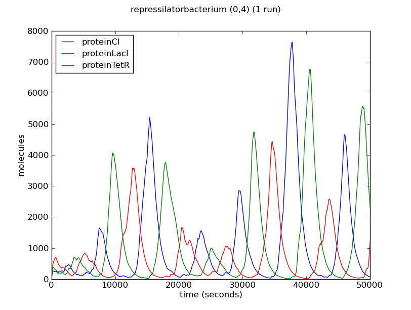
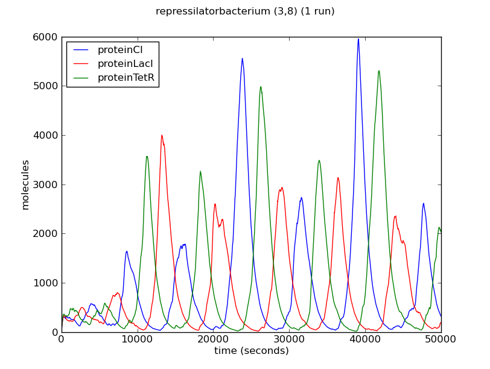
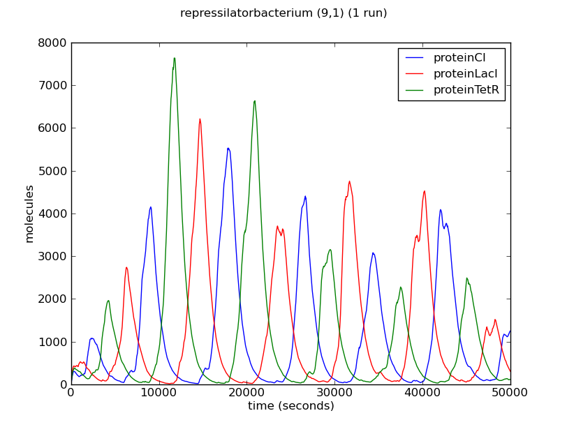
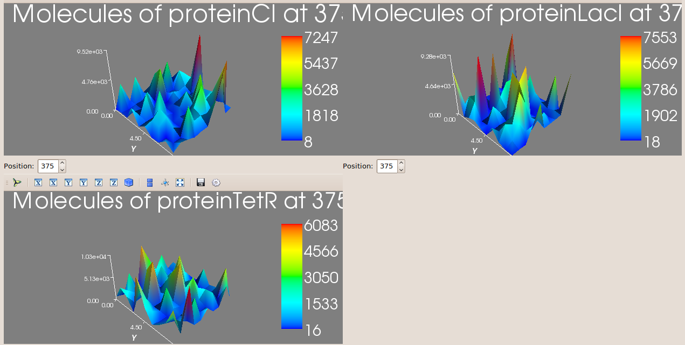

########################
The Repressilator
########################

===========================
Introduction
===========================
 
The **Repressilator** is one the first implemented *synthetic genetic circuits*. It was developed by Michael B. Elowitz and Stanislas Leibler [Elowitz2000]_ . It has been used as a canonical example in synthetic biology in various P system studies [Gheorghe2009]_. 

The **Repressilator** consists of three genes codifying three repressors. Namely, the operon lactose repressor, *lacI*, the repressor form the tetracycline transposon, *tetR*, and a repressor from the λ phage virus, *cI*. These genes are conected in a synthetic gene regulatory network such that LacI represses the expression of the tetR gene, which in turn represses the cI gene. Finally the cycle is closed as CI represses the expression of the lacI gene.

.. figure:: Repressilator.png
   :scale: 40
   :alt: alternate text
   :align: center

The complete model of the repressilator developed using **Infobiotics workbench** is available from this link.

=========================
The Model
=========================

Our model of the **Repressilator** consists of a single bacterial cell modelled as a **SP-system** identified with the name *repressilatorCell*. A bacterial colony of this cell type is then created by distributed cellular clones over the points of a rectangular lattice. 

The molecular interactions in the corresponding *SP-system* are defined in a modular manner using the modules from the **library** *basicLibrary* below:: 

   # Author: Francisco J. Romero-Campero 								#
   # Date: 14 May 2010						  							#
   # Description: A library containing basic gene regulatory   		#
   #			   mechanisms   										#

   libraryOfModules basicLibrary

      # A module representing the unregulated expression of a gene X	#
      UnReg({X},{c_1, c_2, c_3, c_4},{l}) = 
      {
         rules:
         # Transcription of geneX #
         r1: [ geneX ]_l -c_1-> [ geneX + rnaX ]_l 
         # Degradation of the RNA #
         r2: [ rnaX ]_l -c_2-> [ ]_l
         # Translation of the RNA #
         r3: [ rnaX ]_l -c_3-> [ rnaX + proteinX ]_l
         # Degradation of the protein #
         r4: [ proteinX ]_l -c_4-> [ ]_l 
      }

      # A module representing the positive regulation of a protein X #
      # over a gene Y												   #
      PosReg({X,Y},{c_1, c_2, c_3, c_4, c_5, c_6},{l}) =
      {
         rules:
         # Binding and debinding of the transcription factor proteinX to geneY #
         r1: [ proteinX + geneY ]_l -c_1-> [ proteinX_geneY ]_l 
         r2: [ proteinX_geneY ]_l -c_2-> [ proteinX + geneY ]_l 
         # Transcription of geneY when proteinX is bound to its promoter # 
         r3: [ proteinX_geneY ]_l -c_3-> [ proteinX_geneY + rnaY ]_l
         # Degradation of the RNA #
         r4: [ rnaY ]_l -c_4-> [ ]_l
         # Translation of the RNA #
         r5: [ rnaY ]_l -c_5-> [ rnaY + proteinY ]_l
         # Degradation of the protein #    
         r6: [ proteinY ]_l -c_6-> [ ]_l 
      }

      # A module representing the negative regulation of a protein X	#
      # over a gene Y													#
      NegReg({X,Y},{c_1, c_2},{l}) =
      {
         rules:
         # Binding and debinding of the transcription factor proteinX to gene Y #
         r1: [ proteinX + geneY ]_l -c_1-> [ proteinX_geneY ]_l 
         r2: [ proteinX_geneY ]_l -c_2-> [ proteinX + geneY ]_l 
      }

      # A module representing the cooperative regulation of a protein#
      # X over a gene Y #
      CoopNegReg({X,Y},{c_1, c_2, c_3, c_4, c_5, c_6},{l}) =
      {
         rules:
         r1: [ proteinX + geneY ]_l -c_1-> [ proteinX_geneY ]_l 
         r2: [ proteinX_geneY ]_l -c_2-> [ proteinX + geneY ]_l 
         r3: [ proteinX + proteinX_geneY ]_l -c_3-> [ proteinX2_geneY ]_l 
         r4: [ proteinX2_geneY ]_l -c_4-> [ proteinX + proteinX_geneY ]_l 
         r5: [ proteinX_geneY ]_l -c_5-> [ proteinX_geneY + rnaY ]_l 
         r6: [ proteinX2_geneY ]_l -c_6-> [ proteinX2_geneY + rnaY ]_l 
      }

   endLibraryOfModules

The **cell type or bacterial strain** carrying the repressilator is modelled using the following **SP-system**::

   # Author: Francisco J. Romero-Campero #
   # Date: 14 May 2010	#
   # Description: A single cell carrying the repressilator #
   SPsystem repressilatorCell

      # Molecular species present in the system #
      alphabet
         geneCI
         geneLacI
         geneTetR
         proteinCI
         proteinCI2_geneLacI
         proteinCI_geneLacI
         proteinLacI
         proteinLacI2_geneTetR
         proteinLacI_geneTetR
         proteinTetR
         proteinTetR2_geneCI
         proteinTetR_geneCI
         rnaCI
         rnaLacI
         rnaTetR
      endAlphabet

      # This model consists of a single compartment #
      compartments
         bacterium
      endCompartments

      # In the initial state of the system only a single copy of the #
      # genes lacI, cI and tetR are present #  
      initialMultisets
         initialMultiset bacterium
            geneLacI     1
            geneCI       1
            geneTetR     1
         endInitialMultiset
      endInitialMultisets

      # The molecular interactions involved in the reprissilator #
      ruleSets
         ruleSet bacterium

            # CI represses cooperatively the lacI gene which expressed constitutively otherwise #
            CoopNegReg({CI,LacI},{1,224,1,9,0.0005,0.0005},{bacterium}) from basicLibrary.plb
            UnReg({LacI},{0.5,0.00578,0.167,0.00116},{bacterium}) from basicLibrary.plb

            # LacI represses cooperatively the tetR gene which expressed constitutively otherwise #
            CoopNegReg({LacI,TetR},{1,224,1,9,0.0005,0.0005},{bacterium}) from basicLibrary.plb
            UnReg({TetR},{0.5,0.00578,0.167,0.00116},{bacterium}) from basicLibrary.plb

            # TetR represses cooperatively the cI gene which expressed constitutively otherwise #
            CoopNegReg({TetR,CI},{1,224,1,9,0.0005,0.0005},{bacterium}) from basicLibrary.plb
            UnReg({CI},{0.5,0.00578,0.167,0.00116},{bact}) from basicLibrary.plb

         endRuleSet
      endRuleSets
   endSPsystem

The **geometry** of a bacterial colony of the cell type or bacterial strain represented in the previous model is captured using the following rectangular lattice::

   # Author: Francisco J. Romero-Campero              #
   # Date: July 2010                                  #
   # Description: A rectangular lattice of size 5x5 #

   lattice rectangularLattice

      # Dimension of the lattice and lower/upper bounds #
      dimension	2
      xmin      0
      xmax      4
      ymin      0
      ymax      4

      # Parameters used in the definition of the rest of components defining the lattice #
      parameters
         parameter b1 value = 2
         parameter b2 value = 1
      endParameters

      # Basis vector determining the points in the lattice #
      # in this case we have a rectangular lattice         #
      basis
         (b1,0)
         (0,b2)
      endBasis

      # Vertices used to determine the shape of the outmost membrane #
      # of the SP systems located on each point of the lattice       #
      vertices
         (b1/2,b2/2)
         (-b1/2,b2/2)
         (-b1/2,-b2/2)
         (b1/2,-b2/2)
      endVertices

      # Vectors pointing at the neighbours of each point of the lattice #
      neighbours
         (1,0)    (1,1)    (0,1)   (-1,1)
         (-1,0)   (-1,-1)  (0,-1)  (1,-1)	
      endNeighbours

   endLattice

Finally, the model of a **bacterial colony** is obtained by distributing cellular clones of the bacterial cell carrying the repressilator over the points of the previous lattice. This is modelled using the **LPP-system** below:: 

   # Author: Francisco J. Romero-Campero #
   # Date: July 2010 #
   # Description: A multicelluar system consisting of a bacterial colony #
   #              carrying the repressilator #

   LPPsystem repressilatorColony

      # Cell types specified as individual SP systems #
      SPsystems
         SPsystem repressilator from repressilator.sps
      endSPsystems

      # The geometry of the system is determine using a regular finite point lattice #
      lattice rectangular from rectangular.lat

      # Special distribution of the cells over the lattice #
      spatialDistribution
		
         # Bacteria carrying the repressilator are distributed over all the points of the lattice #
         positions for repressilator
           parameters
              parameter i = 0:1:4
              parameter j = 0:1:4
           endParameters
           coordinates
              x = i
              y = j
           endCoordinates
         endPositions

      endSpatialDistribution
   endLPPsystem

The complete model of the repressilator developed using the **Infobiotics workbench** can be download from this link.

========================
Simulations
========================

Stochastic simulations of our model of the repressilator can be run using the **Infobiotics workbench**. For this, please load using the provided interface the simulation parameter file, *simulation_paramters.params*, provided with the files comprising this example. Be patient, these simulations could take a few minutes. 

Below we show the evolution over time of the number of proteins LacI, CI and TetR in three different bacteria from the colony. Note that the system exhibits *oscillatory behaviour* that is *not synchronised* between different bacteria. 

The oscillatory behaviour of the system and the lack of synchronisation between bacteria can be observed more clearly in the dynamics of the entire colony:

This `video <http://www.infobiotics.org/infobiotics-workbench/various/video_colony_100.mpeg>`_ shows the spatio-temporal evolution of the number of proteins LacI, CI and TetR in our model of a bacterial colony carrying the repressilator. 

=========================
 Model Checking
=========================

