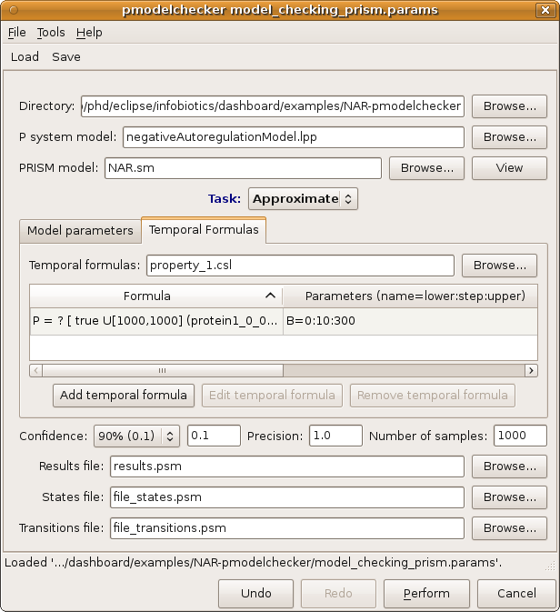

##################################################
Analysis of model properties
##################################################

1. Click on the **Model checking (PRISM)** tab from the upper menu bar to open up the dialog window below that will allow you to specify the properties to analyse in your model.    

2. Load the model checking parameter file **model_checking_prism.params** by clicking **Load** from the upper menu bar and navigating to the location of the negative autoregulation model. 

3. Run your model checking analysis by clicking on the **Perfom** button on the bottom right corner of the model checking window dialog.  

4. Once your analysis have finished the following tab will appear automatically showing a plot of the results.

