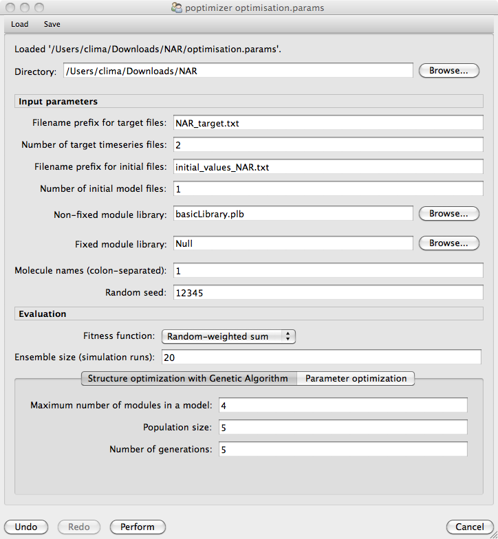

#################################################################
Structural and Parameter Optimisation 
#################################################################

1. Click on the **Optimisation** tab from the upper menu bar to open up the dialog window below that will allow you to specify how the structure and parameter optimisation is performed.

2. Load the optimisation parameter file **optimisation.params** by clicking **Load** from the upper menu bar and navigating to the location of the negative autoregulation model. 

3. Run the optimisation procedure by clicking on the **Perfom** button at the bottom of the optimisation dialog window. This process should take around one minute.  

4. Once the optimisation have finished the following tab will appear automatically showing the output of the best model found against the desired target behavior.

FIGURE
##############

