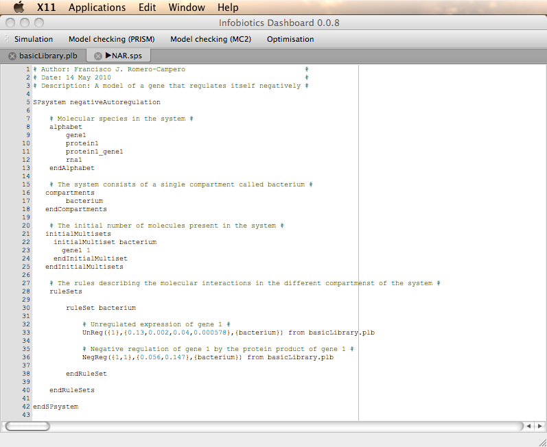
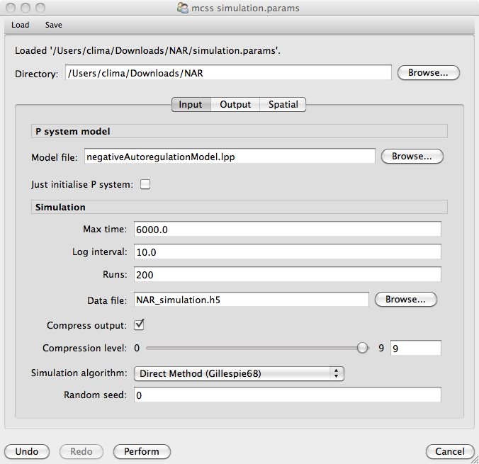
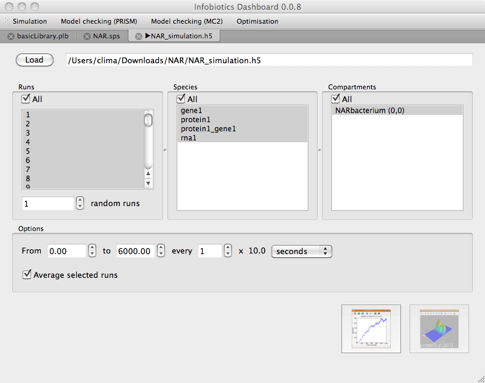
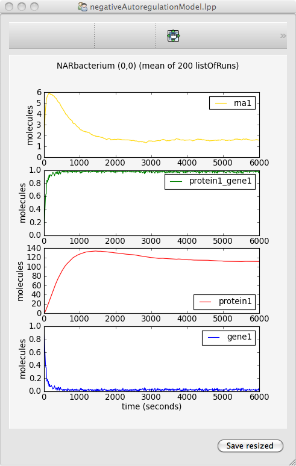

###################################
Quick Start 
###################################

In this **quick start** we will walk through an example based on gene negative autoregulation (NAR) to explain the basics of getting started with the **Infobiotics Workbench**. Alternatively you can follow our `video tutorial <http://www.infobiotics.org/infobiotics-workbench/various/quick_start_video.mpeg>`_.

1. First you need to download and install *Infobiotics Workbench* from this `link <http://www.infobiotics.org/infobiotics-workbench/download/download.html>`_.

2. Download the example containing the `NAR model <http://www.infobiotics.org/infobiotics-workbench/various/NAR.zip>`_ and unzip it to your favourite location. 

3. Open the **Infobiotics Workbench** by double clicking on the corresponding icon located on your desktop (Windows) or by choosing it from your Applications menu (Mac/Linux). The following window will appear showing the different components: *simulation*, *model checking* (PRISM and MC2) and *optimisation*. 

4. Click on the **Simulation** tab from the upper menu bar to open up the dialog window below that will allow you to specify your simulation parameters.

5. Load the simulation parameter file **simulation.params** by selecting **Load** from the upper menu bar and navigating to the location of the *NAR model*. 

6. Run your simulations by clicking on the **Perfom** button at the bottom of the simulation dialog window.  

7. Once your simulations have finished the following tab will appear to allow you to plot the results.

8. Plot the average number of molecules over time by selecting *All* from the **Runs panel** on your left, from the **Species panel** at the center and from the **Compartments panel** on your right and clicking on the first button at the bottom right corner.         

9. A window will pop up to allow you to combine graphs in different ways. Select all the graphs and click the *Stack* button. The following window containing the graphs will appear. You can save this graph by clicking on the last button at the bottom left corner.    

**Infobiotics workbench** is not limited to perform simulations, you can apply other techniques to analyse and manipulate your models. Click in the links below if you are interested in the different components of our workbench. 

.. toctree::
   :maxdepth: 1

   modelProperties
   optimization

For more details on how to use **Infobiotics Workbench** read our tutorial. 

