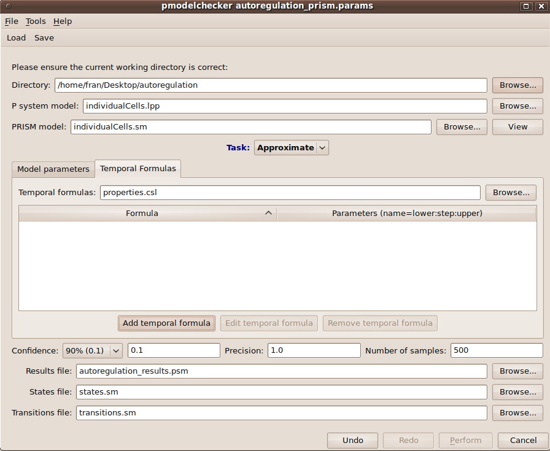

############################################
Model Formal Analysis using Model Checking
############################################

The Infobiotics Workbench allows you to analyse *probabilistic spatio-temporal properties* of your models using two model checkers `PRISM <http://www.prismmodelchecker.org/>`_ and `MC2 <http://www.brc.dcs.gla.ac.uk/software/mc2/>`_. In this tutorial we will use our running example based on `autoregulation <http://www.infobiotics.org/infobiotics-workbench/various/autoregulation.zip>`_ to illustrate this feature. Alternatively, you can see our `video tutorial <http://www.infobiotics.org/infobiotics-workbench/various/model_checking_tutorial.mpeg>`_.

Click on the **Model checking (PRISM)** tab located on the upper menu bar of the *infobiotics dashboard* to start up the dialog window below that will allow you to specify your model properties and the necessary parameters.

First of all, you need to specify your **working directory**. Click on the first **Browse** button at the top right corner of the dialog window and navigate to the folder where the files comprising the *autoregulation model* are located. Next you need to introduce the name of the file containing your **P system model** (lpp file). In our running example we will analyse the behaviour of single cells carrying three different gene regulatory mechanisms, *gene unregulated expression*, *positive autoregulation* and *negative autoregulation*. This model is specified in the file *individualCells.lpp*, please click on the corresponding **Browse** button and select this file. 

Infobiotics workbench allows you to perform different **Tasks** in order to analyse properties of your model. The first task you must perform is to **Translate** your model into the specific language used by the model checker PRISM. In order to do this you need to provide a name for the **PRISM model**. Please type *autoregulation.sm* in the corresponding box. This model will be created after you click on the **Perform** button located at the bottom of the model checking dialog window. The PRISM model can be inspected by clicking on the **View** button next to the PRISM model box. You should see the following windows:

Typically, a *PRISM model* has a set of *parameters* representing the *upper and lower bounds* for the number of the different molecular species in the system. The *stochastic constants* associated with rules can also be model parameters. The values for these parameters must be specified using the **Model parameters** tab in the model checking dialog window and the box enumerating the **Model constants**. Notice that a brief description of each parameter is provided to assist you in choosing appropriate values for them. For our case study, please click on the *Value* box to set all the lower bounds for the different number of molecules to 0, the upper bounds for *gene1* and *protein1_gene1* to 1 and the rest of upper bounds to 1000.   

The properties to be analysed can be specified using the **Temporal Formulas** tab. Click on it and give a name to the file where the properties will be saved, for example type *properties.csl*. New formulas can be added by clicking on the **Add temporal formula** button. Existing formulas can be modified by clicking on the **Edit temporal formula** or deleted by clicking of the **Remove temporal formula** button. 

When specifying or editting the formulas that represent your model properties the following window will pop up. This window allows you to specify/edit your formula, *add/edit/remove parameters* used in your properties and insert model parameters in your formula using the corresponding *drop down list* and **Insert** button. In our example, we analyse the **response time** (time needed to reach half the maximal expression of gene) of the different regulatory mechanisms represented in the *autoregulation* case study. The temporal formulas associated with the response time computes the probability of the number of *protein1* molecules at positions *(0,0)*, *(1,0)* and *(2,0)* in the comparments *NARbacterium*, *PARbacterium* and *UnRegbacterium* to exceed 50 molecules at time T where this parameter varies from 0 to 60 with a step of 1 as the following figure shows:

For more details on how to specify your model properties using temporal formulas read our documentation.     

In our case study we will approximate the probabilities associated with the above temporal formulas. For this, please choose **Approximate** from the *drop down list* specifying the different **Tasks** that can be performed. Note that **Verify** is also available to analyse properties, nevertheless this task is computationally very expensive and is only feasible for very small systems. You also need to specify the **Number of samples** or simulation runs of your model that will be used in the approximation of the propabilities associated with your model properties. Please type 500 runs for our example. 

Finally, the **Results file** containing the output of the model checking analysis must be provided, *autoregulation_results.sm* for our example. Your model checking dialog window should look similar to the figure below:     

Other parameters such as the *states/transitions files* and *precision/confidence of the approximation* can be specified. Although they are not relevant in our running example they can be of interest for your analysis, see our documentation for more details. 

You can save your model checking parameters by clicking on the **Save** button located on the upper menu bar of the model checking dialog window. These can be loaded in order to reproduce your model checking settings by clicking on the **Load** button and choosing the file containing your parameters.

In order to run the analysis of your model properties according to the parameters you have introduced click on the **Perform** button located at the bottom right corner. Once the model checking finishes the following tab appears on the main window to allow you to see the results for your different model properties. 

.. figure:: model_checking_results_tutorial.png
   :scale: 60
   :alt: alternate text
   :align: center

A graph is generated for each temporal formula representing your model properties. These graphs can be detached so you can see the results from the different properties one next to the other by clicking on the **Detach** button at the bottom right corner.  

The Infobiotics Workbench also allows you to analyse properties of your models using `MC2 <http://www.brc.dcs.gla.ac.uk/software/mc2/>`_. In this case you are able to reuse previous simulations performed for your model. Please click in the link below for a short tutorial on how to use the model checker MC2 integrated in Infobiotics Workbench.

.. toctree::
   :maxdepth: 1
   
   modelCheckingMC2

