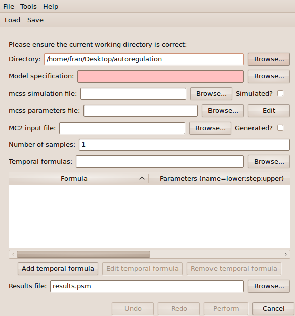
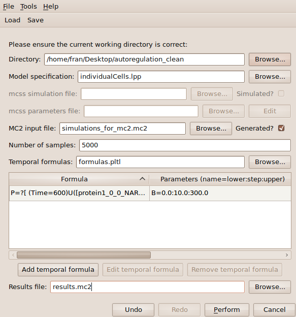
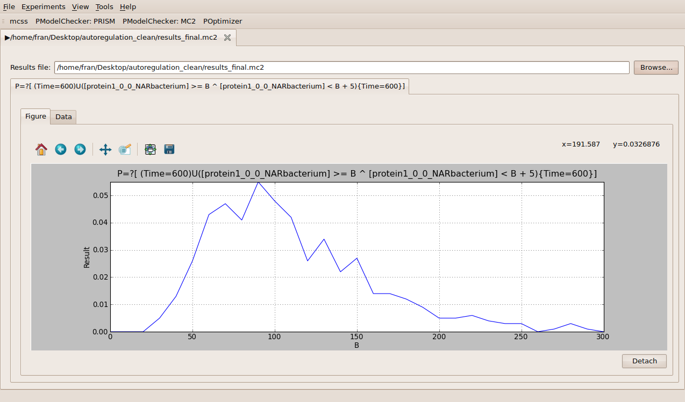

############################################
Model Checking with MC2
############################################

Click on the **Model checking (MC2)** tab located on the upper menu bar of the infobiotics dashboard to start up the dialog window below that will allow you to specify your model properties and the necessary parameters to analyse them using MC2.

Similar to PRISM, you need to specify your **working directory** by clicking on the first **Browse** button of the dialog window and navigating to locatin of the *autoregulation model*. You also need to introduce the name of the file containing your **P system model** (lpp file), *individualCells.lpp* in our example. Please click on the corresponding **Browse** button and select this file. 

MC2 allows you to reuse previously performed simulations of your models. In order to illustrate this, we have included in the folder containing the *autoregulation model* 5000 simulations in mc2 format in the file *simulations_for_mc2.mc2*. Please tick the **Generated?** box next to the *MC2 input file* box and choose the file *simulations_for_mc2.mc2* by clicking on the **Browse** button in order to use the simulations contained in the file. These simulations can also be generated using *mcss*, the simulator integrated in *Infobiotics workbench*, by providing in the corresponinding box the name for the simulation output file from mcss and the corresponding parameters by clicking on the **Edit** button. 

You also need to provide in the box **Number of samples** the number of simulation runs to be used by MC2. Similar to model checking with PRISM your model properties must be specified as temporal formulas. You can introduce your model properties by clicking on the **Add temporal formula** button or by providing the name of the file containing them using the corresponding **Browse** button. For our example, please choose the file *formulas.pltl*. Finally, you have to enter the name of the **Results file** where the computed probabilities will be stored.     

Your model checking dialog window should look similar to the one below:

You can save your parameters by clicking on the **Save** button located on the upper menu bar of the dialog window. These can be loaded in order to reproduce your analysis settings by clicking on the **Load** button and choosing the file containing your parameters.

In order to analyse your model properties click on the **Perform** button located at the bottom right corner. A progress bar will pop up to inform you that the process is running correctly. Once the model checking is over the following tab will appear on the main window to show you the results.

