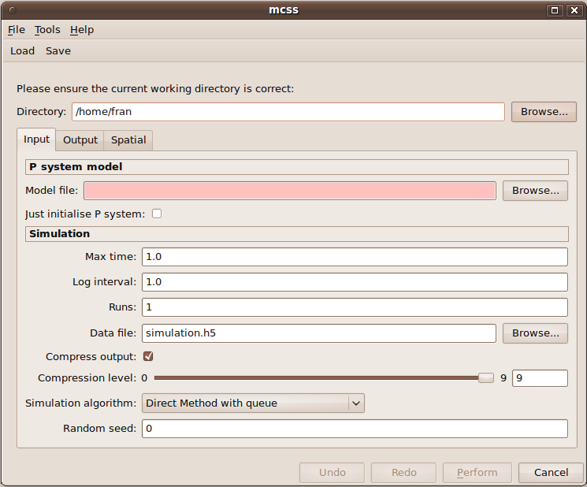
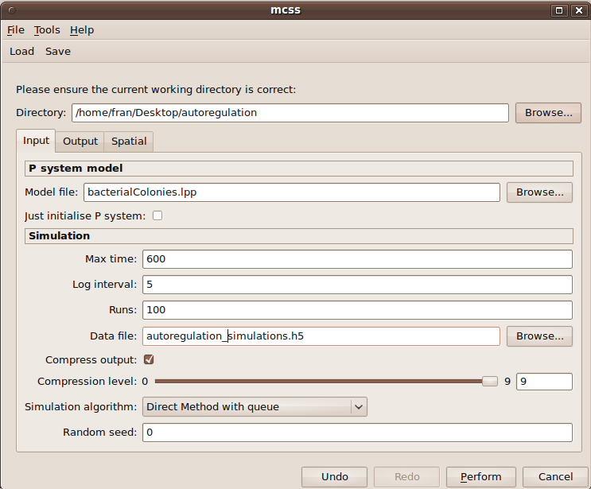
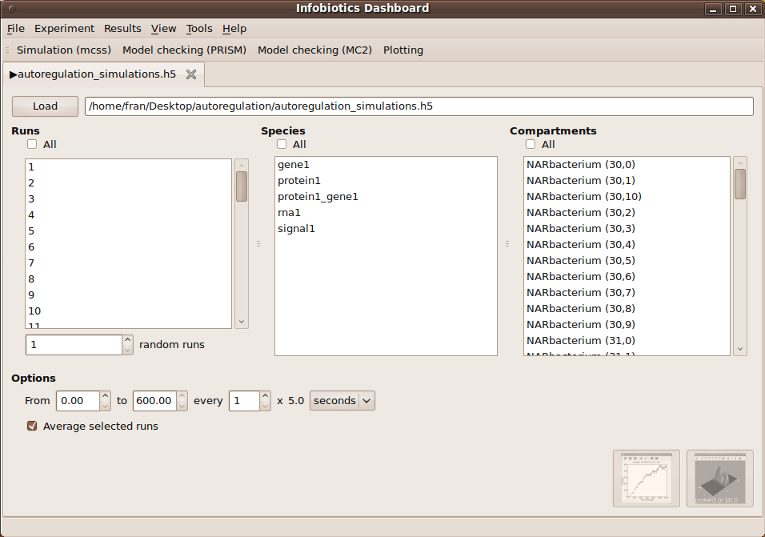
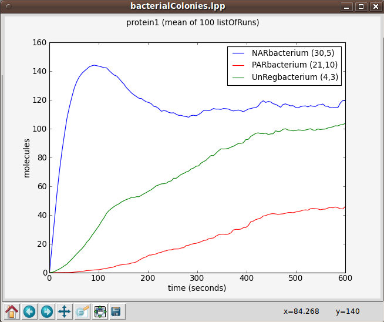
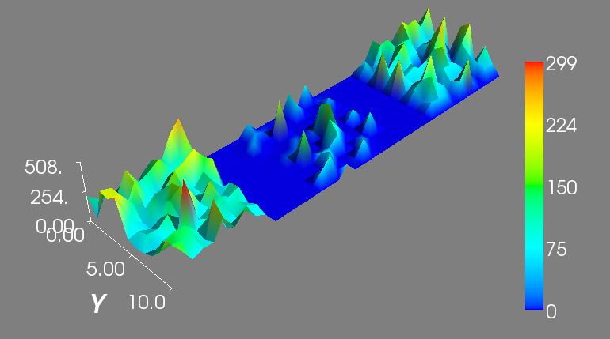

############################################
Multi-compartmental Stochastic Simulations
############################################

The Infobiotics Workbench allows you to perform stochastic simulations of your models. In this tutorial we will use our running example based on autoregulation to illustrate this feature. Alternatively, you can see our `video tutorial <http://www.infobiotics.org/infobiotics-workbench/various/colonySimulation.mpeg>`_.

Click on the **Simulation** tab located on the upper menu bar of the *infobiotics dashboard* to start up the dialog window below that will allow you to specify your simulation parameters.

In order to run your simulations you need to provide the following parameters:
  1. First you need to specify your **working directory**. Click on the **Browse** button at the top right corner of the dialog window and navigate to the folder where the files comprising the autoregulation model are located.  
  2. **Model file:** You need to specify the file containing the multi-cellular model, *bacterialColonies.lpp* in our example. Click on the **Browse** button next to the Model file box and choose the corresponding lpp file.  
  3. **Max time:** The time you want your model to be simulated for must be specified in the corresponding box. For our example, please type 600.   
  4. **Log interval:** You need to set how often you want to save the state of your system in your simulation file. Please type 5 for our example.   
  5. **Runs:** The number of simulation runs to perform must be introduced in this box. In our example it is enough to run 100 simulations.  
  6. **Data file:** You must specify the name of the output file where your simulations will be saved. For instance, you can choose *autoregulation_simulations.h5* for our case study.  

The rest of the input parameters will be set to their default values in our example. Your simulation dialog window should look similar to the one below:

Other simulations parameters involving output and some spatial properties can be specified. Although they are not relevant in our running example they can be of interest for your models, see our `documentation <http://www.infobiotics.org/infobiotics-workbench/completeDocumentation/completeDocumentation.html>`_ for more details. 

You can save your simulation parameters by clicking on the **Save** button located on the upper menu bar of the simulation dialog window. These can be loaded in order to reproduce your simulation settings by clicking on the **Load** button and choosing the file containing your parameters.

In order to run your simulations click on the **Perform** button located at the bottom of the window. A progress bar will pop up to inform you that the simulations are running correctly. Once the simulations are over the following tab will appear on the main window to allow you to plot the results.

In our running example we can see the average evolution of *protein1* molecules over time in three bacteria from the different colonies respresenting gene unregulated expression, positive autoregulation and negative autoregulation. In order to obtain a graph with this information choose *All* from the **Runs panel** on your left, *protien1* from the **Species panel** at the center and three bacteria (for example *NARbacterium (30,5)*, *PARbacterium (21,10)* and *UnRegbacterium (4,3)*) from the **Compartments panel** on your right. Finally, click on the first button located at the bottom right corner of the plotting window. A window with three different graphs will appear. You can combine these graphs to produce the figure below by selecting them (holding the key Ctrl) and clicking on the **Combine** button.   

You can also see the spatio-temporal evolution of the number of *protein1* molecules over the entire multi-cellular system for a simulation by selecting a specific run from the **Runs panel** (for example, simulation 1), *protien1* from the **Species panel** and *All* from the **Compartments panel**. Finally, click on the second button located at the bottom right corner of the plotting window. A window will appear to show the spatio-temporal dynamics of *protein1* click on the **Play** button to see an image similar to the one below:

Check our `video <http://www.infobiotics.org/infobiotics-workbench/various/bacterialColonies.mpeg>`_ to see the spatio-temporal evolution of the number of *protein1* molecules.   
