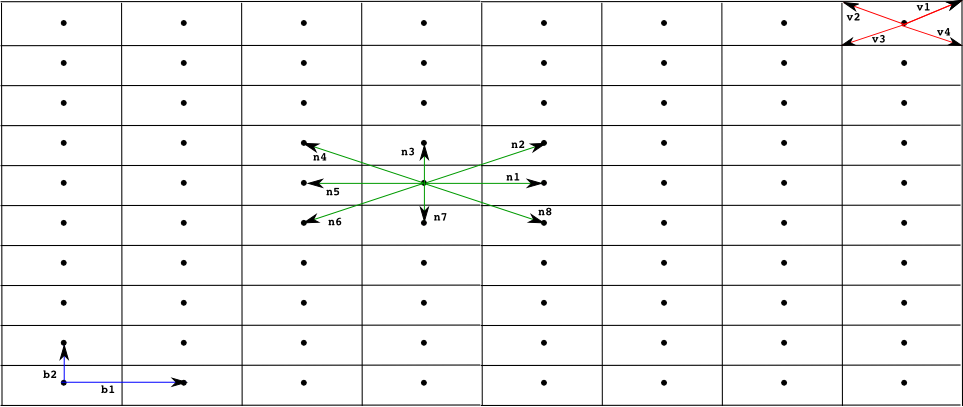
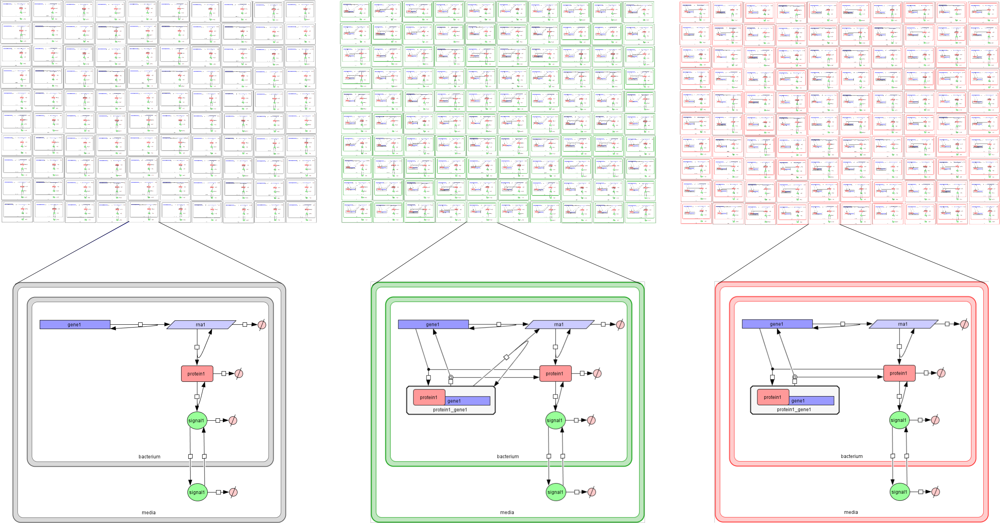

###################################
Model Specification and Building
###################################

The **Infobiotics modelling language** is based on **Stochastic P-systems**. It enables the specification of biological models in an *incremental* and *reusable* manner. *Multi-cellular models* are typically specified in our modelling language using *libraries of modules*, *models of individual cell types* and *geometric distributions* of clones of theses cell types. We will illustrate this using our running example based on `gene autoregulation <http://www.infobiotics.org/infobiotics-workbench/tutorial/tutorial_1.html>`_.

Libraries of reusable modules
#######################################

Libraries of modules must be specified using text files with the extension '.plb'. You can open the file containing the library in our running example, **basicLibrary.plb**, by selecting **File -> Open text file** from the menu.

Our libraries are specified using the key words *libraryOfModules ... endLibraryOfModules*. Each library is identified with a name, *basicLibrary* in our running example and consists of a collection of modules that abstract sets of molecular interactions. In our case we have three different modules, **UnReg**, **PosReg** and **NegReg** describing constitutive gene expression, positive and negative gene regulation respectively. **Comments** can be included using text enclosed between # symbols. Below you have the library used in the autoregulation example::
 
   # Author: Francisco J. Romero-Campero #
   # Date: May 2010 #
   # Description: A library containing basic gene regulatory mechanisms #

   libraryOfModules basicLibrary

      # A module representing the unregulated expression of a gene X #
      UnReg({X},{c_1, c_2, c_3, c_4},{l}) = 
       {
         rules:
           # Transcription of geneX #
           r1: [ geneX ]_l -c_1-> [ geneX + rnaX ]_l 
           # Degradation of the RNA #
           r2: [ rnaX ]_l -c_2-> [ ]_l
           # Translation of the RNA #
           r3: [ rnaX ]_l -c_3-> [ rnaX + proteinX ]_l
           # Degradation of the protein #
           r4: [ proteinX ]_l -c_4-> [ ]_l 
       }

      # A module representing the positive regulation of a protein X over a gene Y #
      PosReg({X,Y},{c_1,c_2,c_3,c_4,c_5,c_6},{l}) =
       {
         rules:
           # Binding and debinding of the transcription factor proteinX to geneY #
           r1: [ proteinX + geneY ]_l -c_1-> [ proteinX_geneY ]_l 
           r2: [ proteinX_geneY ]_l -c_2-> [ proteinX + geneY ]_l 
           # Transcription of geneY when proteinX is bound to its promoter # 
           r3: [ proteinX_geneY ]_l -c_3-> [ proteinX_geneY + rnaY ]_l
           r4: [ rnaY ]_l -c_4-> [ ]_l
           r5: [ rnaY ]_l -c_5-> [ rnaY + proteinY ]_l
           r6: [ proteinY ]_l -c_6-> [ ]_l 
       }
	
      # A module representing the negative regulation of a protein X over a gene Y #
      NegReg({X,Y},{c_1,c_2},{l}) =
       {
         rules:
           # Binding and debinding of the transcription factor proteinX to gene Y #
           r1: [ proteinX + geneY ]_l -c_1-> [ proteinX_geneY ]_l 
           r2: [ proteinX_geneY ]_l -c_2-> [ proteinX + geneY ]_l 
       }

   endLibraryOfModules

A **module** is identified with a name and is associated three sets of *variables*, i.e. *UnReg({X},{c_1, c_2, c_3, c_4},{l})*. The first set of variables can be instantiated with names of specific *molecular species*. The second set of variables can be instantiated with numerical values capturing the *rates* of the molecular interactions represented in the module. Finally, the third set of variables can be instantiated with the names of the *compartments* involved in the molecular interactions.

A module *encapsulates* a set of molecular interactions represented by rules (or other modules) that may use some of the module variables. For example, rules *r1* and *r2* from the *NegReg* module describe the binding/debiding of *proteinX* to/from *geneY*. These processes take place  at rates *c_1* and *c_2* inside compartment *l* represented using square brackets. Note that *X*, *Y*, *c_1*, *c_2* and *l* are *module variables* that can be instantiated with specific values::
 
   r1: [ proteinX + geneY ]_l -c_1-> [ proteinX_geneY ]_l 
   r2: [ proteinX_geneY ]_l -c_2-> [ proteinX + geneY ]_l 

Other attributes can be associated with our modules such as *types* and *specific DNA sequences* see this `example <http://www.infobiotics.org/infobiotics-workbench/models/repository/pulseGenerator.html>`_ or the `documentation <http://www.infobiotics.org/infobiotics-workbench/completeDocumentation/completeDocumentation.html>`_ for more details. 

.. A rule is identified with a name and it represents reactants and products using its right and left hand side respectively. Square brackets with a 
.. label, * [ ]_l *, are used to specify the compartment involved in the interaction. Finally, a constrant   

Cell types
#############################

The **Infobiotics modelling language** supports the specification of *cell types* in two different formats. You can specify your cell types using **SBML**, this `example <http://www.infobiotics.org/infobiotics-workbench/models/repository/lacOperon.html>`_. Alternatively, if you want to use modules of molecular interactions from different libraries defined previously you need to specify your cell type using our modelling language. In this last case, you  must use a text file with the extension **sps**, from *SP-system*.

Our *autoregulation example* uses three different cell types carrying the same gene under three different regulatory mechanisms, unregulated expression (*UnReg.sps*), positive autoregulation (*PAR.sps*) and negative autoregulation (*NAR.sps*). Open the model of the last cell type by selecting **File -> Open text file** from the upper menu bar and choosing the file **NAR.sps**::
 
   # Author: Francisco J. Romero-Campero #
   # Date: July 2010 #
   # Description: A model of a cell type carrying a  gene that regulates itself negatively #
	
   SPsystem negativeAutoregulation
 
      # Molecular species in the system #
      alphabet
         gene1
         protein1
         protein1_gene1
         rna1
         signal1
      endAlphabet

      # The system consists of two compartments called media and bacterium. The bacterium #
      # is embedded in the media #
      compartments
         media
         bacterium inside media
      endCompartments
      
      # The initial number of molecules present in the system #
      initialMultisets
         initialMultiset bacterium
            gene1 1
         endInitialMultiset
      endInitialMultisets

      # The rules describing the molecular interactions in the different compartments #
      # of the system #
      ruleSets

         # Molecular interactions involving the compartment bacterium #		
         ruleSet bacterium	
            # Unregulated expression of gene 1 #
            UnReg({1},{3,0.07,3,0.01},{bacterium}) from basicLibrary.plb
            # Negative regulation of gene 1 by the protein product of gene 1 #
            NegReg({1,1},{1,0.8},{bacterium}) from basicLibrary.plb
            # Protein1 is an enzyme that synthesizes signal 1 #
            r1: [ protein1 ]_bacterium -c1-> [ protein1 + signal1 ]_bacterium      c1 = 0.001
            # Signal1 diffuses freely outside bacteria #		
            r2: [ signal1 ]_bacterium -c2-> signal1 [ ]_bacterium                  c2 = 0.001
            # Singal1 can be degraded inside bacteria #
            r3: [ signal1 ]_bacterium -c3-> [ ]_bacterium                          c3 = 0.0001
         endRuleSet

         # Molecular interactions involving the compartment media #
         ruleSet media
            # Signal1 diffuses freely inside bacteria #
            r1: signal1 [ ]_bacterium -c1-> [ signal1 ]_bacterium                  c1 = 0.001
            # Signal1 can be degraded in the media #
            r2: [ signal1 ]_bacterium -c2-> [ ]_bacterium                          c2 = 0.0001
            # Signal1 diffuses freely to neighbouring media #
            r3: [ signal1 ]_bacterium =(1,0)=[ ] -c3-> [ ]_bacterium =(1,0)=[ signal1 ]      c3 = 0.00025
            r4: [ signal1 ]_bacterium =(-1,0)=[ ] -c3-> [ ]_bacterium =(-1,0)=[ signal1 ]    c3 = 0.00025
            r5: [ signal1 ]_bacterium =(0,1)=[ ] -c3-> [ ]_bacterium =(0,1)=[ signal1 ]      c3 = 0.00025
            r6: [ signal1 ]_bacterium =(0,-1)=[ ] -c3-> [ ]_bacterium =(0,-1)=[ signal1 ]    c3 = 0.00025
         endRuleSet

      endRuleSets 
	
   endSPsystem

A cell type is specified using the key words *SPsystem ... endSPsystem*. Each cell type is identified with a name, *negativeAutoregulation* in our example above, and specifies the following components of a *single-cell* model:
  1. The **molecular species** in the cell type are specified as a list of names (*gene1, protein1, etc*) enclosed between the key words *alphabet ... endAlphabet*. 

  2. The **compartments** of the cell type are listed using the key words *compartments ... endCompartments*. Each compartment is specified using its name. If a compartment is embedded in another one the key word *inside* is used. For instance, the cell type above consists of two compartments, *media* and *bacterium*.  The compartment bacterium is contained in the media which is specified as *bacterium inside media*.  

  3. The **initial number of molecules** is specified with the key words *initialMultisets ... endInitialMultisets*. Each comparmtent is specifically associated with its initial number of molecules using the key words *initialMultiset ... endInitialMultiset* and its name. The number of molecules is specified as a list of molecular species names followed by a positive integer number. In our example, only a single copy of *gene1* is initially present in the compartment bacterium.  

  4. The **molecular interactions** taking place inside or between compartments are enumerated within the key words *ruleSets ... endRuleSets*. The molecular interactions associated with a compartment with name *CompName* are specified as a list of rules and instantiated modules enclosed between the key words *ruleSet ... endRuleSet* and identified with *CompName*. The library file where the modules are defined must be specified after the module instantiation using the key word *from*. In our example, the interactions involving the compartment bacterium are specified using two instantiated modules defined in the *basicLibrary.plb* file (*UnReg({1},{3,0.07,3,0.01},{bacterium})* and *NegReg({1,1},{1,0.8},{bacterium})*) and three rules describing the synthesis of *singal1* by *protein1* (rule *r1*), the diffusion of *singal1* outside the bacterium (rule *r2*) and the degradation of *signal1* (rule *r3*). The values of the *stochastic constants* associated with these rules are also stated at the end of the rule specifications . Note that the outtermost compartment of a cell type can diffuse molecules to neighbouring cells using rules of the same form as rules *r3*, *r4*, *r5* and *r6* in the media compartment. A vector *v* is associated with this type of rule. The application of a rule of this form in a cell located at position *p* moves the corresponding molecules to the cell located at position *p+v*.
Geometric distribution
##############################  

The **Infobiotics modelling language** allows you to specify the spatial distribution of cells in multi-cellular systems. The characteristic geometry of such systems is captured using **finite point lattices** (a grid of regularly distributed spatial points) that must be specified in files with the extension **lat**. Our running example uses a rectangular lattice similar to the one shown below. 

Open the rectangular lattice used in our example by selecting **File -> Open text file** from the upper menu bar and choosing the file **rectangular.lat**::
 
   # Author: Francisco J. Romero-Campero              #
   # Date: July 2010                                  #
   # Description: A rectangular lattice of size 40x10 #

   lattice rectangularLattice

      # Dimension of the lattice and lower/upper bounds #
      dimension	2
      xmin      0
      xmax      39
      ymin      0
      ymax      9

      # Parameters used in the definition of the rest of components defining the lattice #
      parameters
         parameter b1 value = 2
         parameter b2 value = 1
      endParameters

      # Basis vector determining the points in the lattice #
      # in this case we have a rectangular lattice         #
      basis
         (b1,0)
         (0,b2)
      endBasis

      # Vertices used to determine the shape of the outmost membrane #
      # of the SP systems located on each point of the lattice       #
      vertices
         (b1/2,b2/2)
         (-b1/2,b2/2)
         (-b1/2,-b2/2)
         (b1/2,-b2/2)
      endVertices

      # Vectors pointing at the neighbours of each point of the lattice #
      neighbours
         (1,0)   (1,1)    (0,1)   (-1,1)
         (-1,0)  (-1,-1)  (0,-1)  (1,-1)	
      endNeighbours

   endLattice

A lattice is specified using the key words *lattice ... endLattice* and identified with a name, *rectangularLattice* in our example. The specification of a lattice consists of the following components:
  1. Currently, our modelling language supports only one and two dimensional lattices. This must be specified after the key word **dimension**.

  2. The lattice size is determined by the **lower and upper bounds** specified using the key words *xmin*, *xmax*, *ymin* and *ymax* followed by positive integer values. 

  3. A set of **parameters** can be used in the lattice specification. These are introduced using the key words *parameters ... endParameters*. Each parameter is identified with a name and is given a value.

  4. The points of a lattice are determined by a set of **basis vectors** that are listed within the key words *basis ... endBasis*. The lattice points are then obtained as all the possible linear combinations of the basis vectors with integer coefficients within the given bounds.  

  5. A regular polygon, a rectangle in our example, is associated with each lattice point to specify the shape of the cell located in that position. The **vertices** of the polygon are computed using a list of vectors introduced using the key words *vertices ... endVertices*.

  6. A neighbourhood is associated with each lattice point. This is specified as a list of vectors within the key words *neighbours ... endNeighbours*. 
A model of a multi-cellular system in our modelling language consists of a **Lattice Population P-system**, LPP-system for short, a distribution of many clones of the different cell types represented as SP-systems over lattice points. These models must be specified in text files with the extension 
**lpp**. Open the model of our multi-cellular system consisting of three bacterial colonies by selecting **File -> Open text file** from the upper menu bar and choosing the file **bacterialColonies.lpp**::
 
   # Author: Francisco J. Romero-Campero                                           #
   # Date: July 2010                                                               #
   # Description: A multicelluar system consisting of three bacterial colonies     #
   #              combining bacteria carrying the same gene under three different  #
   #              regulatory mechanisms. Namely, unregulated expression, positive  #
   #              autoregulation and negative autoregulation                       #

   LPPsystem threeColonies

      # Cell types specified as individual SP systems #
      SPsystems
         SPsystem UnReg from UnReg.sps
         SPsystem PAR from PAR.sps
         SPsystem NAR from NAR.sps
      endSPsystems

      # The geometry of the system is represented using a regular finite point lattice #
      lattice rectangular from rectangular.lat

      # Special distribution of the cells over the lattice points#
      spatialDistribution
		
         # Bacteria carrying gene1 expressed constitutively are place on the left #
         positions for UnReg
            parameters
               parameter i = 0:1:9
               parameter j = 0:1:9
            endParameters
            coordinates
               x = i
               y = j
            endCoordinates
         endPositions

         # Bacteria carrying gene1 regulating itself positively are place at the center #
         positions for PAR
            parameters
               parameter i = 15:1:24
               parameter j = 0:1:9
            endParameters
            coordinates
               x = i
               y = j
            endCoordinates
         endPositions

         # Bacteria carrying gene1 regulating itself negatively are place on the right #
         positions for NAR
            parameters
               parameter i = 30:1:39
               parameter j = 0:1:9
            endParameters
            coordinates
               x = i
               y = j
            endCoordinates
         endPositions

      endSpatialDistribution

   endLPPsystem

A multi-cellular model is specified using the key words *LPPsystem ... endLPPsystem* and is identified with a name, *threeColonies*, in our example. The specification of a multi-cellular model consists of the following components:

  1. A **list of cell types** defined as SP-systems introduced within the key words *SPsystems ... endSPsystems*. Each cell type is specified using the key word *SPsystem* followed by the name given to the cell type, the key word *from* and the file where the single cell model is specified. Recall that single-cell models can be specified in sps format as described above or in SBML format. Our autoregulation example uses three different cell types UnReg, PAR and NAR introduced in the files UnReg.sps, PAR.sps and NAR.sps respectively. 

  2. The declaration of the geometry of the system uses the key word *lattice* followed by a name, the key word *from* and the file where the corresponding **finite point lattice** is specified. Our example uses a rectangular lattice described in the rectangular.lat file.   

  3. The **spatial distribution** of cellular clones over the lattice points. This is specified using the key words *spatialDistribution ... endSpatialDistribution*. A list of **positions** associated to each cell type is introduced using the key words *positions for ... endPositions* specifying the name of the corresponding SP-system. These positions can use some parameters with specific ranges described using the key word *parameter* followed by the parameter name, the equal symbol and the lower bound, step and upper bound separated by *:* symbols. Finally the **coordinates**, *x* and *y*, are specified as mathematical expressions that may use the previously introduced parameters. 

Below you have a figure representing the **autoregulation model** with its specific cell types and spatial distribution. 

.. **Credits:**

.. The Infobiotics modelling language was developed by Francisco J. Romero-Campero  with contributions from  Jamie Twycross, Jonathan Blakes and 
.. Hongqing Cao. It is being used on Systems and Synthetic Biology research projects in the University of Nottingham, U.K. 
