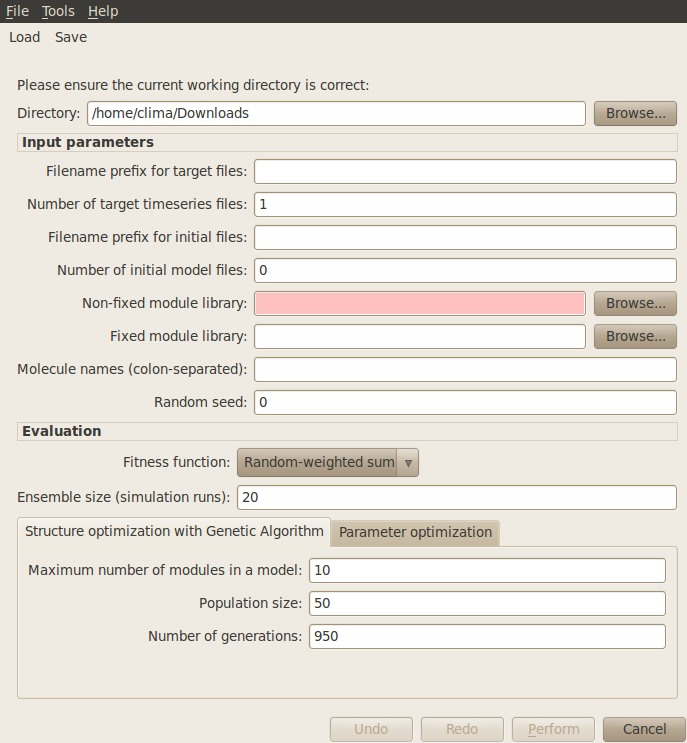
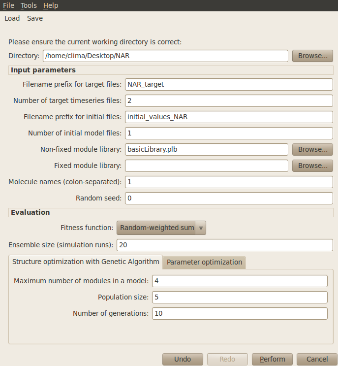

########################################################
Model Structure and Parameter Optimisation
########################################################

The Infobiotics Workbench allows you to optimise the sructure and parameters of your models using evolutionary algorithms. In this tutorial we will the example based on negative autoregulation to illustrate this feature. Alternatively, you can see our video tutorial.

Click on the **Optimisation** tab located on the upper menu bar of the infobiotics dashboard to start up the dialog window below that will allow you to specify the optimisation parameters.

In order to optimise your models you need to provide the following parameters:

  1. First you need to specify your **working directory**. Click on the **Browse** button at the top right corner of the dialog window and navigate to the folder where the files comprising the negative autoregulation model are located.

  2. **Filename prefix for target files**: You need to specify the prefix for the filenames containing the target times series. For example, setting the prefix *target*, the files should be named as *target1.txt*, *target2.txt*, and so on (as many different initial conditions you want to consider). For our example, please type *NAR_target*.

  3. **Number of target timeseries files**: Specifies the number of different target timeseries. This number should match the number of columns (not counting with the time column) in the target files. For the example, type *2* (which correspond to 'protein' and 'rna').

  4. **Filename prefix for initial files**: You also need to specify the filename prefix that contains the initial conditions for the objects. For example, setting the prefix *initial*, the files should be named as *initial1.txt*, *initial2.txt*, and so on (as many different initial conditions you want to consider). Please type *initial_values_NAR* for our example.

  5. **Number of initial model files**: Specifies the number of different initial conditions. This number should match the number of different initial and target files. In our example insert the value *1*.

  6. **Non-fixed module library**: Here you need to insert the filename that contains the library of modules that are variable i.e. that can be instantiated with different objects, kinetic constants, and compartments. For the example use *basicLibrary.plb*.

  7. **Fixed model library**: Specifies the filename that contains a library of fixed modules that should be in every candidate model. For our example there is no need to specify such library.

  8. **Molecule names (colon-separated)**: Specifies all the molecules that can instantiate the modules. You can simply set *1* for the example. 

  9. **Random seed**: Introduces the seed for the random generator in optimisation. Leave it to the default value *0* to set the seed based on the current time of your machine.

  10. **Fitness function**: The fitness function determines how to measure the quality of the candidate models. You can simply use the default *Random-weight sum* method.

  11. **Ensemble size (simulation runs)**: Number of stochastic simulations performed to evaluate each candidate model. This parameter can set to the default value *20* when running the example.

  12. Under **Structure optimisation with Genetic Algorithm** tab, you can specify some of the algorithm parameters for structure optimisation, such as:
	* **Maximum number of modules in a model**: Indicates the maximum number of modules a candidate model can contain. For the example, please type *4*.
	* **Population size**: Number of candidate models in the GA population. For the example, choosing *5* should be enough.
	* **Number of generations**: Number of GA iterations. Please type *10*, which should give enough time to the GA to find the target model.
  13. Under **Parameter optimisation** tab, you can specify some of the parameters for parameter optimisation, such as:
	* **Optimisation algorithm**: Determines which method should be used for parameter optimisation. You can choose between different evolutionary algorithms or simply go with the default method *Genetic Algorithm*.
	* **Proportion of population to optimise**: Defines the proportion of candidate models that go under parameter optimisation. Ideally, all candidate models should have optimised parameters, but for computational reasons sometimes the user may choose to only optimise a certain best proportion of the population. For the example, you can set this value to *0.4*.
	* **Population size**: Number of candidate parameter sets in the population. For the example, choosing *5* should be enough.
	* **Number of generations**: Number of iterations taken by the parameter optimisation method. For the example, choosing *10* should be sufficient to find the appropriate parameters.

Your simulation dialog window should look similar to the one below:

You can save your optimisation parameters by clicking on the **Save** button located on the upper menu bar of the optimisation dialog window. These can be loaded in order to reproduce your optimisation settings by clicking on the **Load** button and choosing the file containing your parameters.

In order to run the optimisation click on the **Perform** button located at the bottom right corner. A progress bar will pop up to inform you that the simulations are running correctly. Once the optimisation has finished (it should take less than a minute) the following tab will appear on the main window to allow you to visualise the behaviour of the best model found against the target model. You can also inspect the  optimised model.

FIGURE
##############
	

