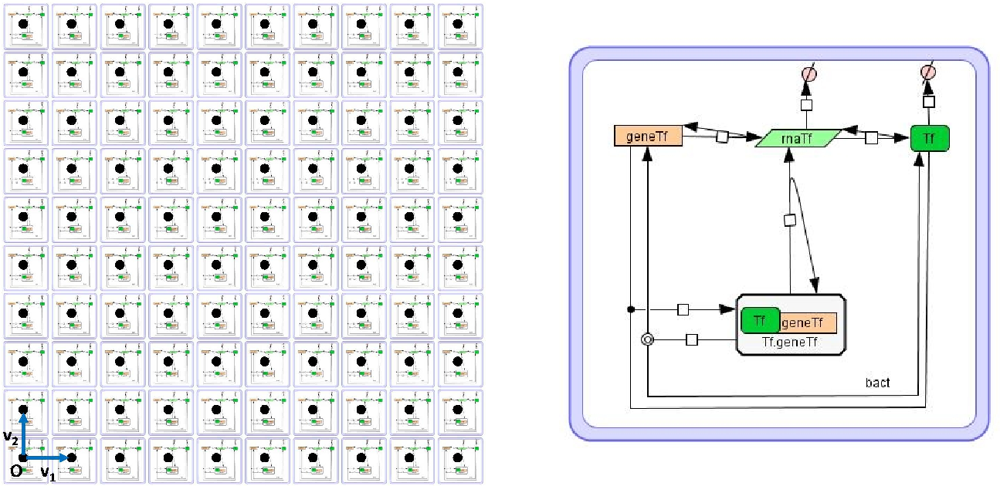

###################################
Model Specification and Building
###################################

The specification and building of **multi-cellular system** models in *Infobiotics* is *modular* allowing *parsimonious* and *incremental design*. In this chapter, the *Infobiotics modelling language* is introduced using a running example consisting of the synthetic bacterial colony designed by Ron Weiss' group in [Basu2005]_.  This model implements the propagation of a wave of gene expression in a bacterial colony. 

The **Infobiotics modelling language** provides a *multi-compartmental*, *stochastic* and  *rule-based specification framework*. A model of a multi-cellular system in *Infobiotics* is developed as a **Lattice Population P-system (LPP-system)** which consists of the specification of three main components that can be defined in a modular manner:

1. First, the different **cell types** in the multi-cellular system need to be specified including their molecular species, compartmentalised structure and molecular interactions.

2. Second, the **geometric distribution** of the cells in the multi-cellular system has to be captured using a finite point lattice, a regularly distributed collection of spatial points.

3. Finally, the **specific localisation** of the different cells over the lattice points must be described in order to obtain the final spatial distribution in the multi-cellular system.

   Example of an *LPP-system* consisting of the distribution of the model of a single cell containing a negative autoregulated gene (right) over a regular rectangular lattice (left). 

The specification of the different parts of a multicelluar system using the **Infobiotics modelling language** is specified in the following sections:

.. toctree::
   :maxdepth: 2

   individualCells
   geometricalDistribution
   multicellularSystems

**Credits:**

The Infobiotics modelling language was developed by Francisco J. Romero-Campero  with contributions from  Jamie Twycross, Jonathan Blakes and Hongqing Cao. It is being used on Systems and Synthetic Biology research projects in the University of Nottingham, U.K. 
