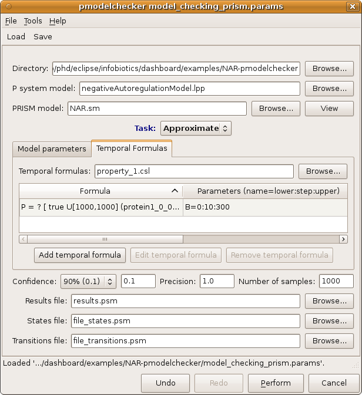
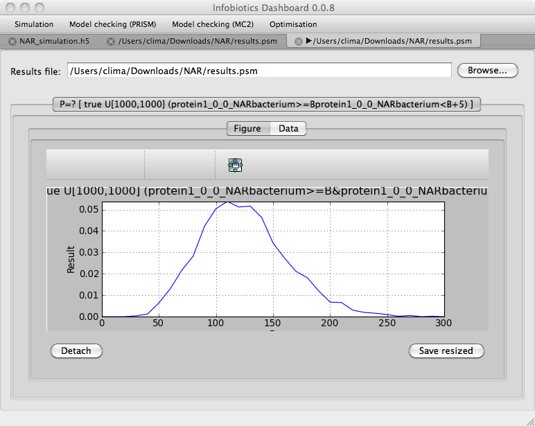

##################################################
Analysis of model properties
##################################################

1. Click on the *Model checking (PRISM)* button on the toolbar to open up the dialog window below that will allow you to specify the properties to analyse in your model.    

2. Load the model checking parameter file *model_checking_prism.params* by clicking **Load** from the dialog toolbar and navigating to the location of the negative autoregulation model. 

3. Check the parameters then run the experiment by clicking on the **Perform** button.  

4. Once the experiment has finished the following tab will appear automatically showing a plot of the results.

.. More complex queries with several formulas and multiple variables will generate a more complex interface with 3-dimensional plots and controls with which to explore the answers, as the figure below demonstrates [picture of 3D plot.]

.. toctree::
   :maxdepth: 1

   optimization
   
For more details on how to use the **Infobiotics Workbench** you can read the `tutorials <http://www.infobiotics.org/infobiotics-workbench/tutorial/tutorial.html>`_.