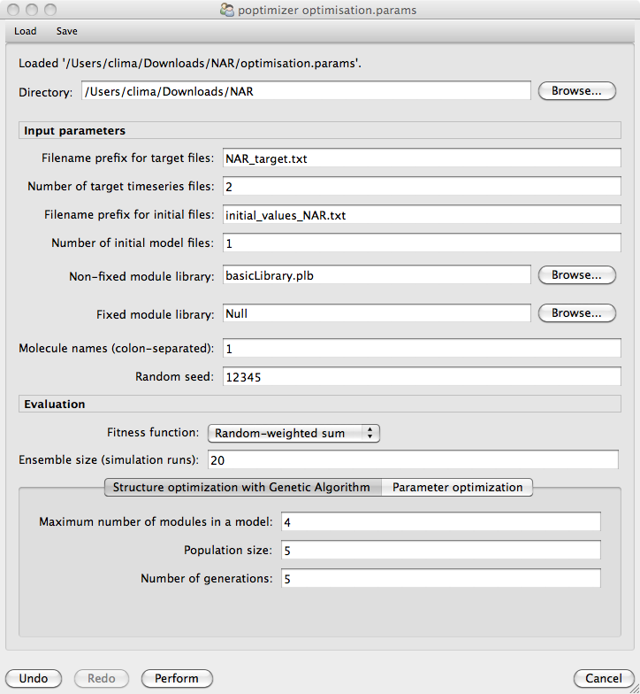

#################################################################
Structural and Parameter Optimisation 
#################################################################

1. Click on the **Optimisation** button on the toolbar to open up the dialog window below that will allow you to specify how the structure and parameter optimisation is performed.

2. Load the optimisation parameter file **optimisation.params** by clicking the **Load** button on the toolbar and navigating to the location of the negative autoregulation model. 

3. Run the predefined optimisation experiment by clicking on the **Perform** button. This process should take approximately one minute.  

4. Once the experiment has finished the following dialog will appear automatically, detailing best model found and plotting its simulated behaviour against the desired target behaviour.

.. figure:: optimisation_results.png
   :scale: 100
   :alt: Inspecting optimisation results.
   :align: center   
   
For more details on how to use the **Infobiotics Workbench** you can read the `tutorials `tutorial <http://www.infobiotics.org/infobiotics-workbench/tutorial/tutorial.html>`_. 

